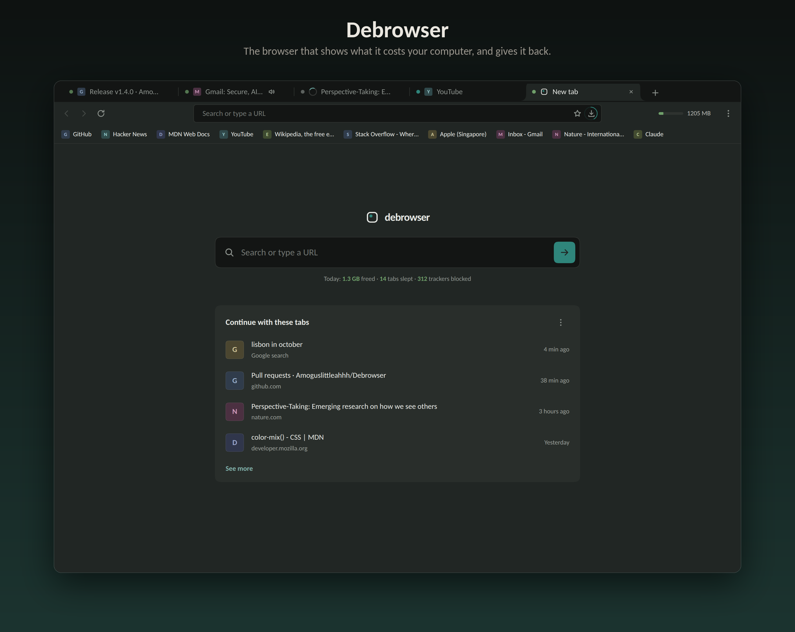

# Debrowser

> [!IMPORTANT]
> **Windows 11: if Smart App Control blocks the installer or uninstaller, run it again a minute later.**
> Debrowser is not code-signed yet, so Windows checks each new file with Microsoft first, and the first
> run can be blocked while that check finishes. If SmartScreen says "Windows protected your PC" instead,
> choose More info → Run anyway. [Why the builds are unsigned](#code-signing-policy)



A web browser built around one idea: **a tab should hold the least memory and
CPU it can get away with, and you should never be able to tell.** Built on
Chromium (through Electron), so real websites work.

- **Tabs that cost almost nothing in the background:** they sleep when you
  leave them, on a schedule you choose, and wake as you come back.
- **A task manager and memory meter** that show what each tab really costs.
- **Ads, trackers and dangerous sites blocked** by the browser itself.
- **Private windows through Tor**, with nothing kept after they close.
- **Spaces, split view, reader view and a command bar (Ctrl+K).**
- **Battery mode** that puts background tabs in your system's efficiency mode.
- **Four designs**, light and dark.

## Download

**[Get the latest release](https://github.com/Amoguslittleahhh/Debrowser/releases/latest)**

| | Download | Then |
|---|---|---|
| **Windows** | `Debrowser-<version>-win-x64.exe` | Run it. It installs for you alone and opens Debrowser. |
| **macOS** | `Debrowser-<version>-mac-arm64.dmg` (`-x64` on Intel) | Drag Debrowser into Applications. The first launch needs System Settings → Privacy & Security → **Open Anyway**. |
| **Linux** | `Debrowser-<version>-linux-x86_64.AppImage` | `chmod +x` and run. |
| **Debian/Ubuntu** | `Debrowser-<version>-linux-amd64.deb` | `sudo apt install ./Debrowser-*.deb` |

A portable Windows build and a `.tar.gz` are on each release too.

## Code signing policy

Free code signing provided by [SignPath.io](https://signpath.io), certificate
by [SignPath Foundation](https://signpath.org), once signing is switched on;
until then the Windows builds are unsigned and the macOS builds are not
notarized, which is what the warnings above are about.

- **What is signed:** only the Windows installers and portable build that
  `.github/workflows/release.yml` builds from this repository on GitHub's runners.
- **Committers and reviewers:** [Amoguslittleahhh](https://github.com/amoguslittleahhh)
  (owner). Changes from anyone else arrive as reviewed pull requests.
- **Approvers:** [Amoguslittleahhh](https://github.com/amoguslittleahhh), by hand, for each release.
- **Privacy:** Debrowser sends nothing about you or your browsing anywhere by
  itself. On its own it only fetches updates (turn them off in Settings), the
  blocking lists, and secure DNS from the provider you choose. Private windows
  connect through Tor. Crash reports are never sent automatically.

## Running from source

```bash
npm install
npm start          # run it
npm run smoke      # the end-to-end test suite, against real pages
```

Needs Node 18 or later, on Windows, macOS or Linux.

## More

- **[The full guide](docs/GUIDE.md):** using it, keyboard shortcuts, private
  windows, profiles, how it keeps tabs cheap, measurements, and limits worth knowing.
- [What's new](CHANGELOG.md) · [Architecture](docs/ARCHITECTURE.md) ·
  [Contributing](.github/CONTRIBUTING.md) · [Security](.github/SECURITY.md) · [Roadmap](docs/ROADMAP.md)
- Open source under the [MIT licence](LICENSE). Bundled components (Chromium,
  Electron, Tor, Readability, the Ghostery engine and the filter lists) keep
  their own licences.
